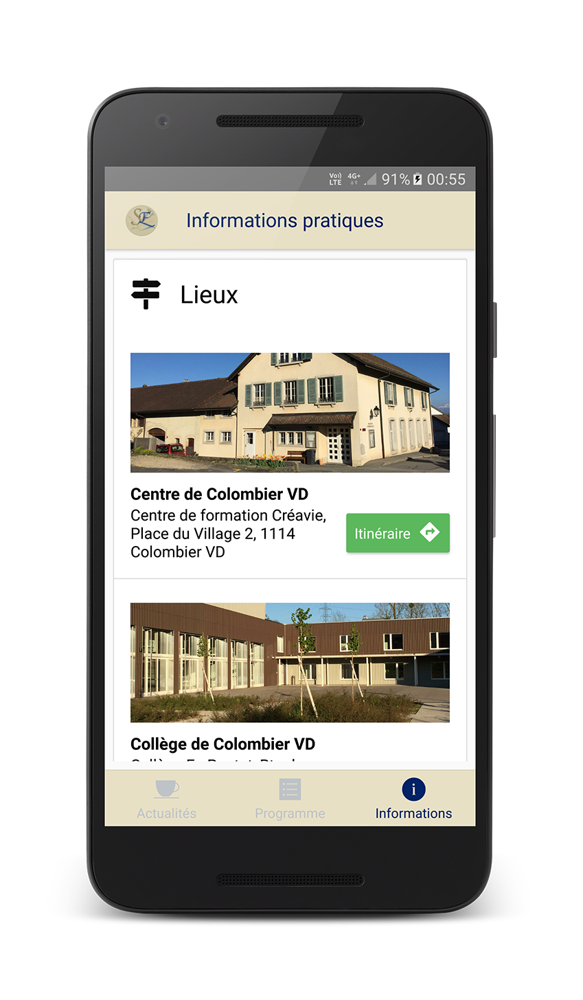

# App development in React Native <br>_for an international event_
Development of an app for the "[Salon International de l'Ecriture](https://www.salonecriture.org/)" (an international event on the art of writing). The app shows the weekly news, the program of the event and some information about it. It is made to fully work online and offline.




You can download this app on <a href="https://play.google.com/store/apps/details?id=com.salonecritureapp">Google Play</a> and the <a href="https://itunes.apple.com/us/app/salonecriture/id1210470736?mt=8">App Store</a>.

## Development details
This app was developed in React-Native for both Android and iOS. You can find the entire source code here.

### Setup

1. Clone this repo on your computer.
2. Go to the root of the react-native project.
3. Install the dependencies:
  ```
  $ npm install
  ```

4. Run the app
  ```
  $ react-native run-android
  $ react-native run-ios
  ```

### To use your own backend service
The app communicates with a REST API hosted on firebase. You can use your own service by changing the file `app/global/GlobalVariables.js`. At lign 8, you can replace the url with your own backend data:
```
const backendURL = 'URL_OF_YOUR_BACKEND_SERVICE';
```
Be careful to use the same API as the one used in the app, or to change the app accordingly.
